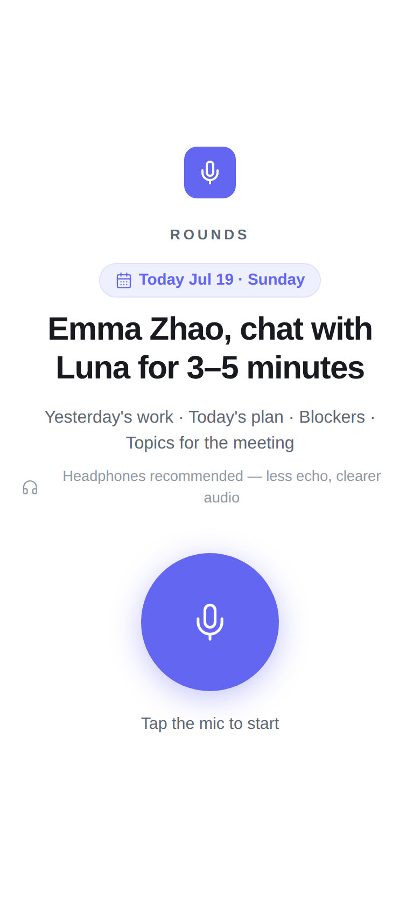
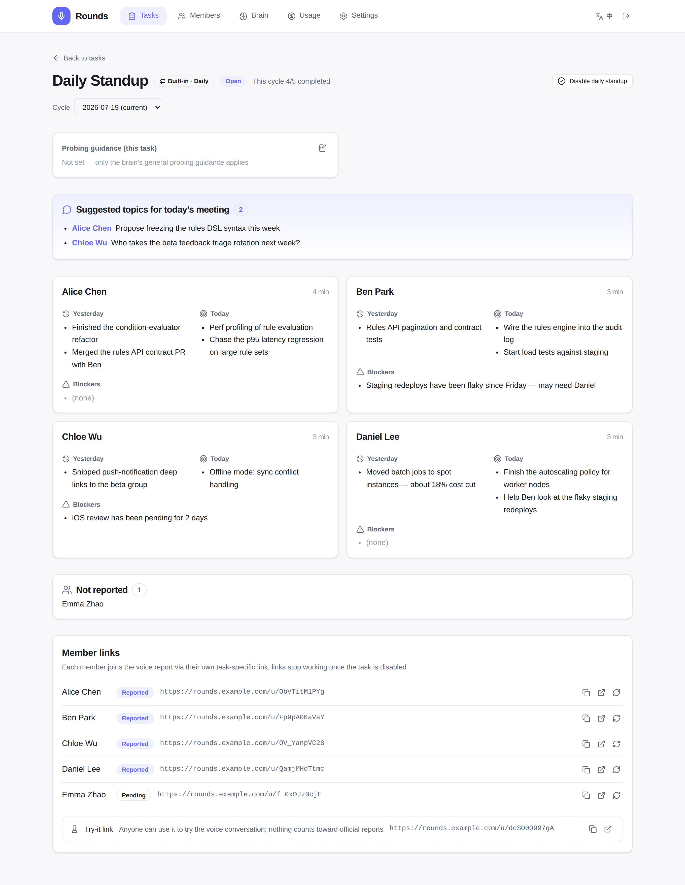
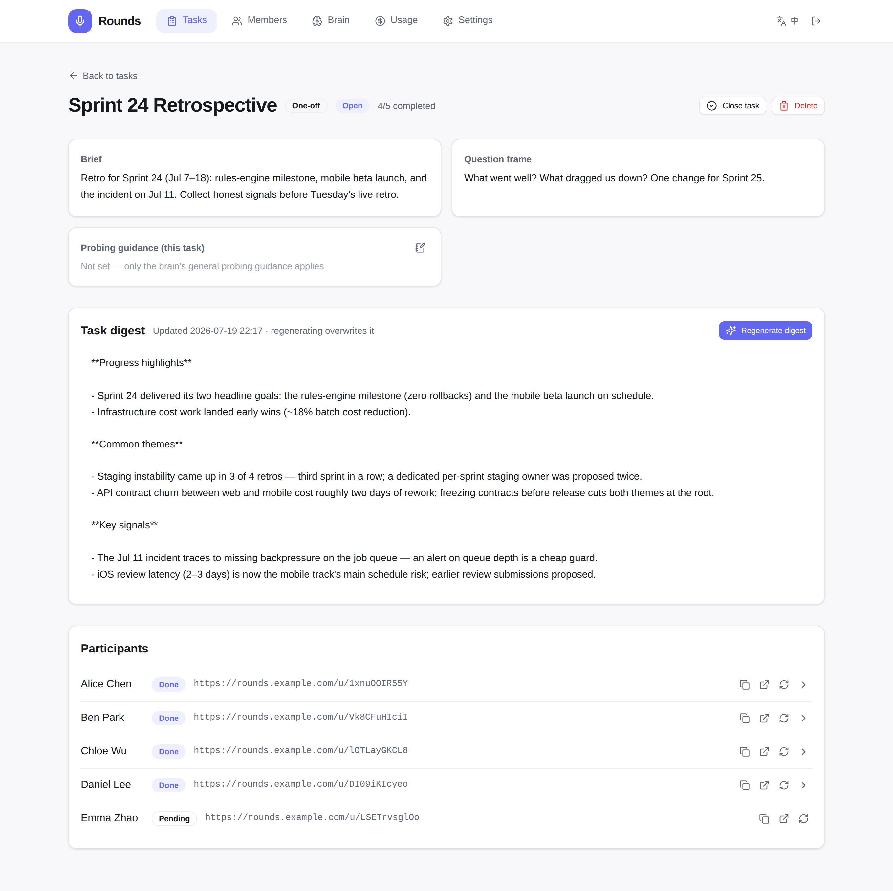
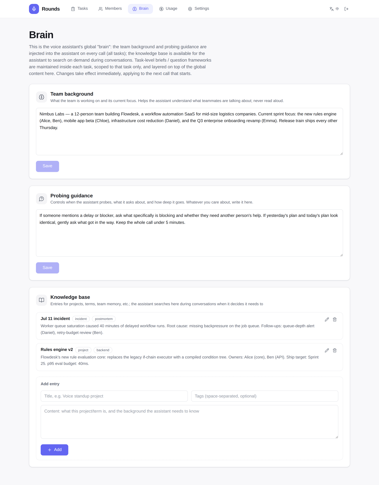
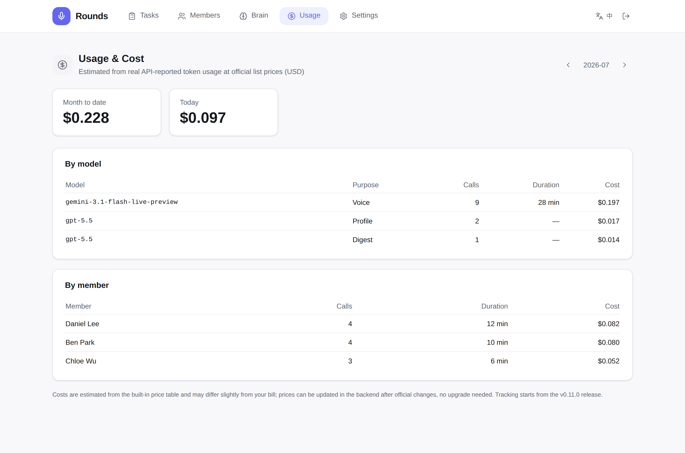

<p align="center">
  
</p>

<h1 align="center">zylos-rounds</h1>

<p align="center">
  Delegated 1:1 voice conversations — the agent makes the rounds for you; daily standup is the first built-in scenario
</p>

<p align="center">
  <a href="./LICENSE"></a>
  <a href="https://nodejs.org/"></a>
  <a href="https://discord.gg/GS2J39EGff"></a>
  <a href="https://x.com/ZylosAI"></a>
  <a href="https://zylos.ai"></a>
  <a href="https://coco.xyz"></a>
</p>

---

- **Voice-first reporting** — each member gets a permanent personal link and
  talks to the agent for 3–5 minutes (昨天 / 今天 / 卡点 / 日会待议); no
  account, no forms
- **Structured + verbatim** — reports are stored as structured summaries
  (via realtime function calling) with the full conversation transcript kept
  alongside
- **Team digest** — per-day digest puts suggested meeting topics first, then
  per-member cards and who hasn't reported; multi-day history included
- **Self-hosted relay, multi-provider** — browser ↔ server ↔ your realtime
  voice provider (OpenAI Realtime and Gemini Live supported; switch models
  from the settings page, works behind a proxy); device-adaptive audio
  capture that survives mobile browsers
- **Admin auth** — scrypt-hashed password (generated at install), session
  cookies, login rate limiting

## Screenshots

### The member side — one personal link, one short call

No login, no forms: each member opens their link, taps the mic, and talks.
The page follows the member's language (中文 / English).

<p align="center">
  
</p>

### The owner side — reports land structured

Suggested meeting topics come first, then per-member report cards, who
hasn't reported yet, and every member's personal link:



### One-off rounds — collect signals, then digest them

Launch a round of 1:1 conversations on any topic (retro, planning survey,
incident follow-up). Per-member summaries roll up into a task digest:



### The agent's brain

Team background and probing guidance are injected into every call; the
knowledge base is searched on demand mid-conversation:



### Usage & cost

Estimated from real API-reported token usage, by model and by member:



## Install

```bash
zylos add rounds
```

The generated admin password is printed once during install.

## Configuration

`~/zylos/components/rounds/config.json` (see [SKILL.md](./SKILL.md) for all
keys):

```json
{
  "enabled": true,
  "port": 3478,
  "model": "gpt-realtime-2.1",
  "voice": "marin",
  "auth": { "enabled": true, "password": "<scrypt hash>" }
}
```

`model` / `voice` in config.json are only install-time defaults — providers,
models, and voices are managed day-to-day from the settings page (OpenAI
Realtime, Gemini Live, or any OpenAI-compatible endpoint).

Provider API keys are entered on the settings page (or via the provider
API) and stored locally in the database. The outbound proxy, if you need
one, goes in config.json (`"proxy": "http://127.0.0.1:7890"`), with the
`HTTPS_PROXY` / `HTTP_PROXY` process environment as fallback — the shared
`~/zylos/.env` is not read at all. Upgrading from an older install that
kept `OPENAI_API_KEY` in the environment? It is migrated into the database
automatically on first start.

## Usage

| URL | Who |
|-----|-----|
| `https://<host>/rounds/` | admin — roster, add/remove members, copy links |
| `https://<host>/rounds/#/report/2026-07-17` | admin — daily digest |
| `https://<host>/rounds/u/<token>` | member — voice conversation |

## Development

Backend: `npm test` / `npm run check`. Frontend lives in `web/` (Vite + React
+ Tailwind + shadcn/ui) and builds into `src/public/` (committed). See
[CLAUDE.md](./CLAUDE.md) for architecture and the relay invariants.

## Design Notes

Project design docs live in [docs/project/](./docs/project/).

## Built by Coco

Zylos is the open-source core of [Coco](https://coco.xyz/) — the AI employee platform.

## License

[MIT](./LICENSE)
